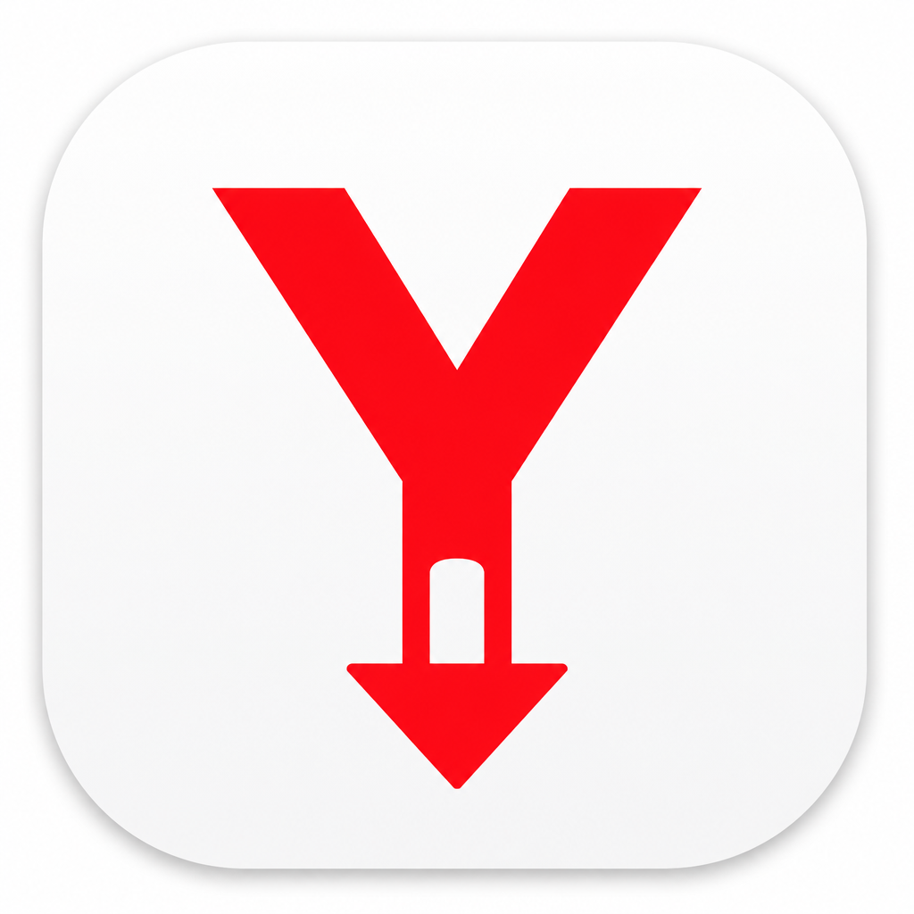

# ytdown

<p align="center">
  
</p>

<p align="center">
  <strong>macOS GUI for downloading YouTube videos and playlists</strong><br>
  MP4 remux by default · H.264 + AAC · built on <a href="https://github.com/yt-dlp/yt-dlp">yt-dlp</a>
</p>

<p align="center">
  
  
  
  
  <a href="LICENSE"></a>
</p>

ytdown is a desktop app for macOS. Paste a YouTube URL, pick a quality, and download. Video is remuxed to MP4 **without re-encoding**, so files stay compatible with Quick Look, Finder, and common players.

## Features

- Desktop window (CustomTkinter) with progress, status, and log
- Default output: **1080p MP4**, remux only (no quality loss from re-encode)
- Quality presets: Best · 1080p · 720p · MP3 (192 kbps) · M4A (AAC)
- Compatible MP4 only: **H.264 (avc1) + AAC (mp4a)** — not AV1/VP9 wrapped as `.mp4`
- `+faststart` so macOS can preview the file with the space bar
- Videos, Shorts, and playlists (`watch`, `youtu.be`, `/playlist`, `/shorts`)
- Playlist auto-detect and per-item progress (`3 of 12`)
- Paste from clipboard, optional auto-download when the URL changes
- Title preview before the download starts
- Remembered output folder, quality, and auto-download (`~/.yt_downloader/`)
- Stop an in-progress download
- Audio tags (`Artist - Title`) via mutagen
- Unsigned `.app` build that can bundle FFmpeg

## Requirements

| Dependency | Why |
| --- | --- |
| **macOS** | Primary platform (GUI, `.app` build, Homebrew paths) |
| **Python 3.10+** | Runtime (3.8 may work; 3.10+ is recommended) |
| **[FFmpeg](https://ffmpeg.org/)** | Merge / remux / audio extract |
| **yt-dlp, CustomTkinter, Pillow, mutagen** | Listed in `requirements.txt` |
| **deno, node, or bun** | Recommended JS runtime for current YouTube formats |

Install FFmpeg and a JS runtime with Homebrew:

```bash
brew install ffmpeg deno
```

Keep **yt-dlp** current. YouTube changes streaming often; an old yt-dlp build typically fails with HTTP 403.

```bash
pip install -U yt-dlp
```

`./start` checks for a yt-dlp update at most once per day.

## Install and run

```bash
git clone https://github.com/Kricula/ytdown.git
cd ytdown
python3 -m venv .venv
source .venv/bin/activate
pip install -r requirements.txt
brew install ffmpeg deno
./start
```

Equivalents:

```bash
python app/bootstrap.py   # splash, then GUI
python app/main.py        # GUI only
./run_gui.command         # Finder-friendly wrapper
```

## Usage

1. Paste a YouTube video or playlist URL (or click **Paste**).
2. Choose quality. Default is **1080p (MP4 remux)**.
3. Pick an output folder (default: `~/Downloads`).
4. Click **Download**. Use **Stop** to cancel.

Playlists are detected from the URL (`list=` or `/playlist`). Between playlist items the app waits a few seconds.

**Auto download on URL change** starts a download when a new valid URL is entered. The last folder, quality, and this switch are stored in `~/.yt_downloader/settings.json`.

Logs: `~/.yt_downloader/downloader.log`.

### Output formats

| Preset | Result |
| --- | --- |
| Best (MP4 remux) | Highest H.264 + AAC stream, remuxed to `.mp4` |
| 1080p (MP4 remux) | Same, capped at 1080p (default) |
| 720p (MP4 remux) | Same, capped at 720p |
| Audio MP3 (192 kbps) | Audio only, 192 kbps MP3 |
| Audio M4A (AAC) | Audio only, AAC in `.m4a` |

Video presets do **not** fall back to “best video + best audio” if that would produce AV1/VP9 + Opus inside an `.mp4`. Those files often fail in Quick Look and DJ software.

## Build a macOS app

Apple Silicon, unsigned `.app` (onedir — no 10–15 s unpack on every launch):

```bash
./build.sh
# or
./build_app.command
```

Result: `dist/YT Downloader.app` with FFmpeg copied in when it is available at build time.

First launch on another Mac is blocked by Gatekeeper. Allow it in **System Settings → Privacy & Security → Open Anyway**, or:

```bash
xattr -cr "dist/YT Downloader.app"
```

## Disclaimer

ytdown is a convenience GUI around [yt-dlp](https://github.com/yt-dlp/yt-dlp). It does **not** host, store, or redistribute video or audio. The user chooses the URL and starts every download.

This project is **not** affiliated with, endorsed by, or sponsored by YouTube, Google, or any site that yt-dlp can access.

The software is provided **as is**, without warranty of any kind, express or implied, including merchantability, fitness for a particular purpose, and noninfringement. **In no event shall the authors be liable** for any claim, damages, or other liability arising from the software or from its use — including downloading, copying, or sharing content.

You are solely responsible for how you use this software. You must comply with copyright law, YouTube’s terms of service, and any other applicable rules in your country. Do not download or keep material unless you have the legal right to do so.

This repository does not support or encourage copyright infringement. ytdown only accepts official YouTube URLs (watch, Shorts, playlist). That follows [yt-dlp’s policy](https://github.com/yt-dlp/yt-dlp/blob/master/CONTRIBUTING.md#is-the-website-primarily-used-for-piracy) of not supporting services that exist mainly to infringe copyright.

The full warranty disclaimer and liability waiver are in [LICENSE](LICENSE).

## License

This project is released under the [Unlicense](https://unlicense.org) — the same license as [yt-dlp](https://github.com/yt-dlp/yt-dlp/blob/master/LICENSE). See [LICENSE](LICENSE).

## Acknowledgments

- [yt-dlp](https://github.com/yt-dlp/yt-dlp)
- [FFmpeg](https://ffmpeg.org/)
- [CustomTkinter](https://github.com/TomSchimansky/CustomTkinter)
- [mutagen](https://github.com/quodlibet/mutagen)
